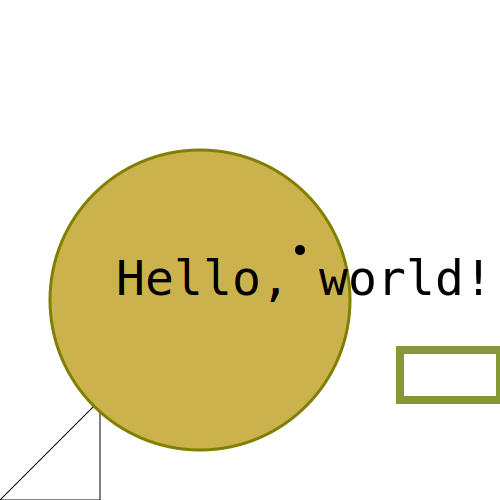

# Monet − A vector graphics library for C++11

[](https://ziotom78-monet.readthedocs.io/en/latest/)
[](https://opensource.org/licenses/MIT)
[](http://semver.org/spec/v2.0.0.html)

Monet is a header-only C++11 graphics library with no 3rd-party
dependencies to create vector graphics. The API is not completely
stable yet, but it should not change too much before the release of
version 1.0.0.

The library is licensed using the MIT license. See the file
[LICENSE.md](https://github.com/ziotom78/monet/blob/master/LICENSE.md)
for further information.

## Example

```c++
#include <monet.hpp>

using namespace monet;

int main() {
  SVGCanvas canv("output.svg", 500, 500);
  
  // Create a closed path
  canv.moveto(Point(0.0, 0.0));
  canv.lineto(Point(100.0, 0.0));
  canv.lineto(Point(100.0, 100.0));
  canv.closepath();
  canv.strokepath();

  // Paths can be stroked and filled at the same time
  canv.setfillcolor(Color{0.8, 0.7, 0.3});
  canv.setstrokecolor(brown);
  canv.setstrokewidth(3.0);
  canv.circle(Point(200, 200), 150, Action::FillAndStroke);

  // You can specify colors using HSL
  canv.setstrokecolor(hsl(0.2, 0.5, 0.4));
  canv.setstrokewidth(8.0);
  canv.rectangle(Point(400, 100), Point(500, 150), Action::Stroke);

  // You can group graphical elements (useful if you plan to
  // open the SVG in a vector graphics program like Inkscape)
  canv.begingroup("textandpoint");
  {
      Point textpoint = Point(300, 250);
      canv.setfontsize(48);
      canv.setfontfamily(FontFamily::Monospaced);
      canv.text(textpoint, "Hello, world!", HorizontalAlignment::Center,
                VerticalAlignment::Bottom);

      // Highlight the pivot of the text element by
      // drawing a small circle around it
      canv.setfillcolor(black);
      canv.circle(textpoint, 5, Action::Fill);
  }
  canv.endgroup();
}
```

The program produces the following output:



## Documentation

Hosted at [ReadTheDocs](https://ziotom78-monet.readthedocs.io/en/latest/).
