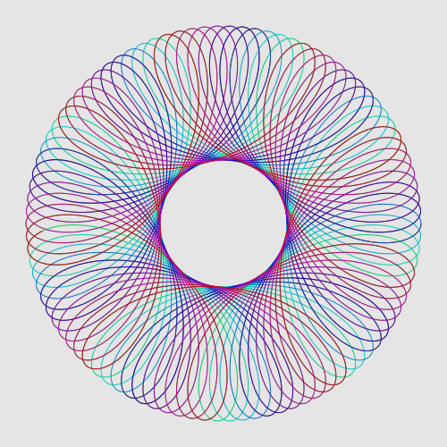

# Monet − A vector graphics library for C++11

[](https://github.com/ziotom78/monet/actions/workflows/c-cpp.yml)
[](https://ziotom78.github.io/monet/)
[](https://opensource.org/licenses/MIT)

Monet is a header-only C++11 graphics library with no 3rd-party dependencies to create vector graphics. Download the file [include/monet.h](https://raw.githubusercontent.com/ziotom78/monet/master/include/monet.h) and put it alongside you source files to use it—no need to change your `Makefile`!

The library is licensed using the MIT license. See the file [LICENSE.md](https://github.com/ziotom78/monet/blob/master/LICENSE.md) for further information.

Documentation is available at https://ziotom78.github.io/monet/

## Simple example

```c++
#include "monet.h"

using namespace monet;

int main() {
  SVGCanvas canv{"simple.svg", 100, 100};

  // Clear the image with a soft gray
  canv.setfillcolor(gray(0.9));
  canv.rectangle(Point{0, 0},
  Point{canv.getwidth(), canv.getheight()}, Action::Fill);

  // Create a closed path
  canv.moveto(Point{0, 0});
  canv.lineto(Point{100, 0});
  canv.lineto(Point{100, 100});
  canv.closepath();
  canv.strokepath();
}
```

Save the program in a file `simple.cpp`, download the file [include/monet.h](https://raw.githubusercontent.com/ziotom78/monet/master/include/monet.h) and put it in the same folder as `simple.cpp`, and compile with the following command:

    c++ -o simple simple.cpp

When the program is ran, it will create the image file `simple.svg`:


## Simulating a spirograph

Let's draw a [spirograph](https://en.wikipedia.org/wiki/Spirograph) pattern!

```c++
#include <cmath>
#include <monet.h>

using namespace std;
using namespace monet;

Point spirograph(double small_r, double large_r, double a, double t) {
  double r_diff{large_r - small_r};
  double r_ratio{small_r / large_r};
  return Point{r_diff * cos(r_ratio * t) + a * cos((1 - r_ratio) * t),
               r_diff * sin(r_ratio * t) - a * sin((1 - r_ratio) * t)};
}

int main() {
  SVGCanvas canv{"spirograph.svg", 500, 500};

  // Clear the image with a soft gray color
  canv.setfillcolor(gray(0.9));
  canv.rectangle(Point{0, 0}, Point{canv.getwidth(), canv.getheight()},
                 Action::Fill);

  Point center{canv.getwidth() / 2, canv.getheight() / 2};

  // Draw the spirograph

  const double small_r{42};
  const double large_r{188};
  const double a{75};
  const double tmax{1000};
  const double delta_t{0.1};

  Point old_point{center + spirograph(small_r, large_r, a, 0)};
  for (double t{delta_t}; t < tmax; t += delta_t) {
    Point new_point{center + spirograph(small_r, large_r, a, t)};
    // By smoothly increasing the hue in the call to `hsl`, we're
    // iterating over all the colors of the rainbow
    canv.setstrokecolor(hsl(t / tmax, 1.0, 0.4));
    canv.line(old_point, new_point);
    canv.strokepath();

    old_point = new_point;
  }
}
```




## A more complex example

```c++
#include "monet.h"

using namespace monet;

int main() {
  SVGCanvas canv{"complex.svg", 500, 500};

  // Create a closed path
  canv.moveto(Point{});
  canv.lineto(Point{100, 0});
  canv.lineto(Point{100, 100});
  canv.closepath();
  canv.strokepath();

  // Paths can be stroked and filled at the same time
  canv.setfillcolor(Color{0.8, 0.7, 0.3});
  canv.setstrokecolor(brown);
  canv.setstrokewidth(3.0);
  canv.circle(Point{200, 200}, 150, Action::FillAndStroke);

  // You can specify colors using HSL
  canv.setstrokecolor(hsl(0.2, 0.5, 0.4));
  canv.setstrokewidth(8.0);
  canv.rectangle(Point{400, 100}, Point{500, 150}, Action::Stroke);

  // You can group graphical elements (useful if you plan to
  // open the SVG in a vector graphics program like Inkscape)
  canv.begingroup(TransformSequence{translate(Point{300, 250})});
  {
    Point textpoint{Point{0, 0}};
    canv.setfontsize(48);
    canv.setfontfamily(FontFamily::Monospaced);
    canv.setfillcolor(black);
    canv.text(textpoint, "Hello, world!", HorizontalAlignment::Center,
              VerticalAlignment::Bottom);

    // Highlight the pivot of the text element by
    // drawing a small circle around it
    canv.setfillcolor(red);
    canv.circle(textpoint, 5, Action::Fill);
  }
  canv.endgroup();
}
```

The program produces the following output:


## Documentation

The manual is available at [ziotom78.github.io/monet/](https://ziotom78.github.io/monet/).
