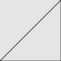

# Monet − A vector graphics library for C++11

[](https://opensource.org/licenses/MIT)
[](http://semver.org/spec/v1.0.0.html)
[](https://github.com/ziotom78/monet/actions/workflows/c-cpp.yml)

Monet is a header-only C++11 graphics library with no 3rd-party dependencies to create vector graphics. Download the file [include/monet.h](https://raw.githubusercontent.com/ziotom78/monet/master/include/monet.h) and put it alongside you source files to use it—no need to change your `Makefile`!

The library is licensed using the MIT license. See the file [LICENSE.md](https://github.com/ziotom78/monet/blob/master/LICENSE.md) for further information.

Documentation is available at https://ziotom78.github.io/monet/

## Simple example

```c++
#include "monet.h"

using namespace monet;

int main() {
  SVGCanvas canv{"simple.svg", 100, 100};

  // Create a closed path
  canv.moveto(Point(0.0, 0.0));
  canv.lineto(Point(100.0, 0.0));
  canv.lineto(Point(100.0, 100.0));
  canv.closepath();
  canv.strokepath();
}
```

Save the program in a file `simple.cpp`, download the file [include/monet.h](https://raw.githubusercontent.com/ziotom78/monet/master/include/monet.h) and put it in the same folder as `simple.cpp`, and compile with the following command:

    c++ -o simple simple.cpp
    
When the program is ran, it will create the image file `simple.svg`:




## A more complex example

```c++
#include "monet.h"

using namespace monet;

int main() {
  SVGCanvas canv{"complex.svg", 500, 500};

  // Create a closed path
  canv.moveto(Point(0.0, 0.0));
  canv.lineto(Point(100.0, 0.0));
  canv.lineto(Point(100.0, 100.0));
  canv.closepath();
  canv.strokepath();

  // Paths can be stroked and filled at the same time
  canv.setfillcolor(Color{0.8, 0.7, 0.3});
  canv.setstrokecolor(brown);
  canv.setstrokewidth(3.0);
  canv.circle(Point(200, 200), 150, Action::FillAndStroke);

  // You can specify colors using HSL
  canv.setstrokecolor(hsl(0.2, 0.5, 0.4));
  canv.setstrokewidth(8.0);
  canv.rectangle(Point(400, 100), Point(500, 150), Action::Stroke);

  // You can group graphical elements (useful if you plan to
  // open the SVG in a vector graphics program like Inkscape)
  canv.begingroup(TransformSequence{translate(Point(300, 250))});
  {
    Point textpoint{Point(0, 0)};
    canv.setfontsize(48);
    canv.setfontfamily(FontFamily::Monospaced);
    canv.setfillcolor(black);
    canv.text(textpoint, "Hello, world!", HorizontalAlignment::Center,
              VerticalAlignment::Bottom);

    // Highlight the pivot of the text element by
    // drawing a small circle around it
    canv.setfillcolor(red);
    canv.circle(textpoint, 5, Action::Fill);
  }
  canv.endgroup();
}
```

The program produces the following output:


## Documentation

Hosted at [ReadTheDocs](https://ziotom78-monet.readthedocs.io/en/latest/).
