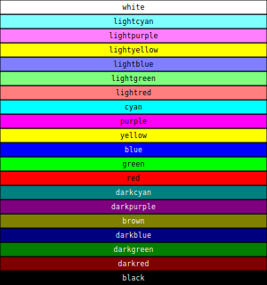

== Reference ==

=== Color ===

A `Color` structure represents a color to be used for painting the
canvas. It contains the following fields:

[cols=",,",options="header",]
|===========================================================
|Field |Type |Meaning
|`r` |`double` |Red level, in the range [0, 1] (inclusive)
|`g` |`double` |Green level, in the range [0, 1] (inclusive)
|`b` |`double` |Blue level, in the range [0, 1] (inclusive)
|===========================================================

The preferred way to create a color is via one of the following
functions (remember, they are not constructors):

* `rgb(r, g, b)` is equivalent to `Color{r, g, b}`, but it is clearer in
stating the color space;
* `hsl(h, s, l)` initializes the color using the hue, saturation, and
luminosity values. In this case too, all the parameters must be in the
range [0, 1] (yes, even the hue). The
link:./tutorial.md#fun-with-colors[tutorial] has a nice explanation of
the meaning of each parameter.
* `gray(l)` initializes the color with a gray shade. It is equivalent to
`hue(0, 0, l)`.

The only method provided by the class `Color` is `toHTML`, which returns
a string containing the HTML representation of the color. A `Color`
object can be printed to a stream using the `<<` operator, as shown in
the following example:

Here is an example showing these operators:

[source,c++]
----
include::ref-color.cpp[]
----

And here is the output:

----
include::ref-color.txt[]
----

Standard colors
^^^^^^^^^^^^^^^

The library provides a number of predefined colors:

=== Fonts ===

Fonts are specified through the `FontFamily` enumeration:

[cols=",",options="header",]
|==================================
|Name |Examples
|`Serif` |Garamond, Times New Roman
|`SansSerif` |Arial, Helvetica
|`Monospaced` |Courier
|==================================

=== Point ===

A `Point` structure represents a 2D point on the canvas. It contains the
following fields:

[cols=",,",options="header",]
|================================
|Field |Type |Meaning
|`x` |`double` |First coordinate
|`y` |`double` |Second coordinate
|================================

To initialize a point, you can use one of the following constructs:

* `Point p` initializes `p` to the coordinates `(0, 0)`;
* `Point p(1, 2)` initializes `p` to the coordinates `(1, 2)`;

The `Point` structure implements a number of operators:

[cols=",",options="header",]
|=======================================================================
|Operator |Meaning
|`+` |Sum two points together
|`-` |Subtract one point from amother
|`*` |Scale a point by a number (both `f * p` and `p * f` are supported)
|`/` |Divide the coordinates of a point by a number
|`+=` |Increment a point using another point
|`-=` |Subtract one point from another
|`*=` |Scale a point by a number in-place
|`/=` |Divide the coordinates of a point by a number in-place
|`<<` |Print the coordinates of the point to a `std::ostream`
|=======================================================================

Here is an example showing these operators:

[source,c++]
----
include::ref-point.cpp[]
----

And here is the output:

[source]
----
include::ref-point.txt[]
----

=== Primitives ===

In Monet’s slang, a _primitive_ is a graphics operation provided by the
canvas. Monet has several primitives, provided by methods of the
`BaseCanvas` class:

[cols=",",options="header",]
|=====================================================================
|Method |Shape
|`circle` |A circle
|`line` |A straight line
|`rectangle` |A rectangle with its sides aligned with the X and Y axes
|=====================================================================

=== Paths ===

The `BaseCanvas` class provides the following methods to
create/modify/draw paths:

[width="100%",cols="28%,72%",options="header",]
|=======================================================================
|Method |Meaning
|`moveto(pt)` |Move to a point without drawing anything

|`lineto(pt)` |Connect the current point to a new point using a straight
line

|`drawpath(seq)` |Repeatedly call `moveto` and `lineto` to draw a vector
of `Point` objects

|`quadraticto(target, end)` |As `lineto`, but the line is curved
(quadratic)

|`cubicto(ctrl1, ctrl2, end)` |As `lineto`, but the line is curved
(cubic)

|`closepath()` |Connect the current point with the first point in the
path

|`strokepath()` |Draw the path on the canvas using the color set with
`setstrokecolor`

|`fillpath()` |Close the path if needed, and then fill it with the color
set with `setfillcolor`

|`fillandstrokepath()` |Combination of `fillpath` and `strokepath`

|`clearpath()` |Cancel the current path and start a new ones
|=======================================================================

A presentation of the commands used to create paths is provided in the
link:./tutorial.md#paths[tutorial].

Once you have finished with a path, you _must_ call `clearpath` before
drawing a new one!

=== Groups ===

A _group_ is a collection of graphical objects. Its main purpose is to
apply a sequence of link:./ref.md#transformations[transformations] to
each object in the collection.

[width="100%",cols="16%,84%",options="header",]
|=======================================================================
|Method |Meaning
|`begingroup(seq, name="")` |Start a new group, applying the sequence of
transformations in `seq` (an object of type `TransformSequence`)

|`endgroup()` |Complete the definition of a group started with
`begingroup(...)`
|=======================================================================

Any call to `begingroup` should be followed by a call to `endgroup`;
however, the library is smart enough to close all the groups that have
been left open when the canvas is going to be destroyed.

Transformations
^^^^^^^^^^^^^^^

A transformation can be applied only to groups, and it is implemented
via the type `Transform`, which is a
https://en.cppreference.com/w/cpp/language/union[union type]
(unfortunately, C++11 lacks the support for
https://en.wikipedia.org/wiki/Algebraic_data_type[algebraic types], and
a class hierarchy would have been too complex and cumbersome to use
here).

The following functions create a `Transform` object:

[width="100%",cols="20%,80%",options="header",]
|=======================================================================
|Function |Meaning
|`translate(pt)` |Translate by `pt.x` along the X direction and by
`pt.y` along the Y direction

|`rotate(angle)` |Rotate by `angle` (in degrees) around point (0, 0)

|`rotate(pt, angle)` |Rotate by `angle` (in degrees) around point `pt`

|`scale(f)` |Scale by a factor `f` (`f = 1` is the identity
transformation)

|`scale(pt)` |Scale by a factor `pt.x` along the X direction and by
`pt.y` along the Y direction

|`scale(fx, fy)` |Scale by a factor `fx` along the X direction and by
`fy` along the Y direction

|`scalex(f)` |Scale by a factor `f` along the X direction, leaving the Y
direction untouched

|`scaley(f)` |Scale by a factor `f` along the Y direction, leaving the X
direction untouched
|=======================================================================

Transformations can be concatenated using the `|` operator. If you think
of two transformations `tr1` and `tr2` as two functions _f_ and _g_, the
C++ expression `tr1 | tr2` is equivalent to the mathematical operation
__g__∘_f_ (function composition; note that the two operators are
reversed). Thus, `tr1 | tr2` means: ``first apply `tr1` (_f_), _then_
apply `tr2` (_g_)''.

Transformations can be passed to `begingroup`: every object within the
call to `begingroup` and `endgroup` will be implicitly transformed by
the sequence of transformations.

Since `begingroup` expects a `TransformSequence`, you cannot pass just
one `Transform` object to it:

[source,cpp]
----
// This won't work
canvas.begingroup(rotate(30));
----

Instead, you must explicitly initialize a `TransformSequence`:

[source,cpp]
----
// This is ok
canvas.begingroup(TransformSequence{rotate(30)});
----

=== Clipping ===

Check out the link:./tutorial.md#clipping[tutorial].
