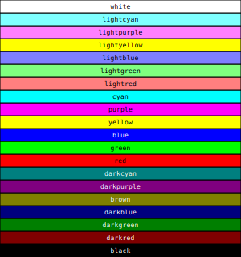

# Reference

## Color

A `Color` structure represents a color to be used for painting the
canvas. It contains the following fields:

Field | Type     | Meaning
----- | -------- | ------------------
`r`   | `double` | Red level, in the range [0, 1] (inclusive)
`g`   | `double` | Green level, in the range [0, 1] (inclusive)
`b`   | `double` | Blue level, in the range [0, 1] (inclusive)

The preferred way to create a color is via one of the following
functions (remember, they are not constructors):

- `rgb(r, g, b)` is equivalent to `Color{r, g, b}`, but it is clearer
  in stating the color space;
- `hsl(h, s, l)` initializes the color using the hue, saturation, and
  luminosity values. In this case too, all the parameters must be in
  the range [0, 1] (yes, even the hue). The
  [tutorial](./tutorial.md#fun-with-colors) has a nice explanation of
  the meaning of each parameter.
- `gray(l)` initializes the color with a gray shade. It is equivalent
  to `hue(0, 0, l)`.

The only method provided by the class `Color` is `toHTML`, which
returns a string containing the HTML representation of the color. A
`Color` object can be printed to a stream using the `<<` operator, as
shown in the following example:

Here is an example showing these operators:

{{snippet_from_file("ref-color.cpp", "c++")}}

And here is the output:

{{code_from_file("ref-color.txt", "text")}}

### Standard colors

The library provides a number of predefined colors:

## Fonts

Fonts are specified through the `FontFamily` enumeration:

Name | Examples
---- | -----------
`Serif` | Garamond, Times New Roman
`SansSerif` | Arial, Helvetica
`Monospaced` | Courier

## Point

A `Point` structure represents a 2D point on the canvas. It contains
the following fields:

Field | Type     | Meaning
----- | -------- | ------------------
`x`   | `double` | First coordinate
`y`   | `double` | Second coordinate

To initialize a point, you can use one of the following constructs:

- `Point p` initializes `p` to the coordinates `(0, 0)`;
- `Point p(1, 2)` initializes `p` to the coordinates `(1, 2)`;

The `Point` structure implements a number of operators:

Operator | Meaning
-------- | ------------------------------
`+`      | Sum two points together
`-`      | Subtract one point from amother
`*`      | Scale a point by a number (both `f * p` and `p * f` are supported)
`/`      | Divide the coordinates of a point by a number
`+=`     | Increment a point using another point
`-=`     | Subtract one point from another
`*=`     | Scale a point by a number in-place
`/=`     | Divide the coordinates of a point by a number in-place
`<<`     | Print the coordinates of the point to a `std::ostream`

Here is an example showing these operators:

{{snippet_from_file("ref-point.cpp", "c++")}}

And here is the output:

{{code_from_file("ref-point.txt", "text")}}

## Primitives

In Monet's slang, a *primitive* is a graphics operation provided by
the canvas. Monet has several primitives, provided by methods of the
`BaseCanvas` class:

Method       | Shape
------------ | -----------------------------------------------------------
`circle`     | A circle
`line`       | A straight line
`rectangle`  | A rectangle with its sides aligned with the X and Y axes

## Paths

The `BaseCanvas` class provides the following methods to
create/modify/draw paths:

Method              | Meaning
------------------- | ---------------------------------------------------
`moveto(pt)` | Move to a point without drawing anything
`lineto(pt)` | Connect the current point to a new point using a straight line
`quadraticto(target, end)` | As `lineto`, but the line is curved (quadratic)
`cubicto(ctrl1, ctrl2, end)` | As `lineto`, but the line is curved (cubic)
`closepath()` | Connect the current point with the first point in the path
`strokepath()` | Draw the path on the canvas using the color set with `setstrokecolor`
`fillpath()` | Close the path if needed, and then fill it with the color set with `setfillcolor`
`fillandstrokepath()` | Combination of `fillpath` and `strokepath`
`clearpath()` | Cancel the current path and start a new ones

A presentation of the commands used to create paths is provided in the
[tutorial](./tutorial.md#paths).

Once you have finished with a path, you *must* call `clearpath` before
drawing a new one!
