== Tutorial ==

=== The first image ===

The first program we are going to write will use Monet to create a SVG
image containing a rectangle and a diagonal line.

Create an empty directory somewhere with name `tut01`, and install the
Monet header file in it with the following command:

....
curl https://raw.githubusercontent.com/ziotom78/monet/master/include/monet.h > monet.h
....

(Of course, you can use `wget` or any other downloader.) Now use your
favourite editor to create the following C++ file, and name it
`tut01.cpp`:

[source,c++]
----
include::tut01.cpp[]
----

Compile the program and run it:

....
gcc -o tut01 tut01.cpp && ./tut01
....

The result is a new `tut01.svg` file, which you can open your
favourite web browser; e.g., if you are using Firefox, open it with
the command `firefox tut01.svg`. You will see the following image
appear within the browser:

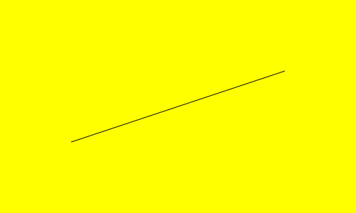

Let’s analyze the code line by line. First of all, every class and
function in the library lives within the `monet` namespace. In this
documentation, we always put put the following statement at the
beginning of the code:

[source,c++]
----
using namespace monet;
----

The first statement in `main` instantiates a _canvas_, i.e., a 2D
surface that accepts graphical commands:

[source,c++]
----
SVGCanvas canvas("tut01.svg", 500, 300);
----

The constructor we are using, `SVGCanvas` saves the plotting commands in
a SVG file. SVG files can be viewed using any Internet browser (e.g.,
Firefox, Chrome, Safari) and edited using vector graphics programs like
https://inkscape.org/[Inkscape], Adobe Illustrator, and Corel Draw!.

The second line sets the _fill color_ for any filling operation that
will follow. We are using one of the predefined colors in Monet,
`yellow` (see the link:./ref.md#standard-colors[reference] for more
color names):

[source,c++]
----
canvas.setfillcolor(yellow);
----

The next line asks Monet to draw a rectangle on the canvas:

[source,c++]
----
canvas.rectangle(Point(0, 0), Point(500, 300), Action::Fill);
----

The rectangle is specified using two opposite corners along one of the
diagonals. The order is irrelevant, but for convention we usually
specify the bottom-left corner first. The third argument specifies how
the rectangle should be drawn:

1.  `Action::Fill` (this case) asks Monet to _fill_ the rectangle with
the fill color we have specified;
2.  `Action::Stroke` draws the outline of the rectangle. In this case,
the _stroke color_ (set using the method `canvas.setstrokecolor`, see
below) would be used instead of _fill color_.
3.  `Action::FillAndStroke` fills the rectangle using the _fill color_
and then draws the outline using the _stroke color_.

Finally, the last two commands set the stroke color to black and draw a
line:

[source,c++]
----
canvas.setstrokecolor(black);
canvas.line(Point(100, 100), Point(400, 200));
----

Once the variable `canvas` goes out of scope (i.e., the program ends),
the file `tut01.svg` is flushed to disk and closed.

=== Coordinate system ===

Monet can create rectangular images, where each point in the image is
located using a Cartesian coordinate system. The bottom-left corner of
the image has always coordinates (0, 0). The coordinates of the
upper-right corner depend on the size of the image, that must be passed
to the constructor. This is what we did in `tut01`:

[source,c++]
----
SVGCanvas canvas("tut01.svg", 500, 500);
----

This instruction tells Monet that the image will be 500×500 wide, i.e.,
a square.

In the following example, we use `SVGCanvas.text` and `SVGCanvas.circle`
to show the coordinates of a few points in a canvas.

[source,c++]
----
include::tut02.cpp[]
----

Compile the code as usual; the output will be the following:

You can see that the _x_ and _y_ coordinates increase from left to
right, and from bottom to top, like in the Cartesian plane.

Many new concepts are used in this new program:

1.  We have used a C++ `for` loop to iterate the creation of many
graphical elements; of course, as Monet is used in C++ programs, we can
use any construct we want to place graphical elements on the canvas.
2.  We have used text functions.
3.  We have used mathematical operations with the `Point` structure.

The call to `canvas.text` passes `pt + Point(0, canvas.getfontsize())`
as the coordinate where to put the text. `Point` is a structure that can
be used with a few mathematical operators. In our example, we used the
addition (`operator+`) in order to shift the text a bit above the
circle. See the link:./ref.md#point[reference] for more information.

The amount of vertical shift is given by the result of a call to
`canvas.getfontsize()`, which returns the height of a character of text.
Had we avoided this fix, like here:

[source,c++]
----
include::tut02-bad.inc.cpp[]
----

the result would have been uglier:

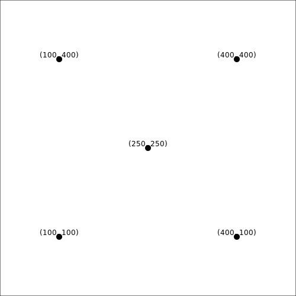

=== Fun with colors ===

There are several ways to specify colors in Monet:

1.  Use one of the predefined constants, like `black`, `yellow`,
`darkred`, `lightgreen`, etc.;
2.  Specify a color using its RGB (red-green-blue) components;
3.  Specify a shade of gray;
4.  Specify a color using its HSL (hue-saturation-lightness) components.

Here is an example:

[source,c++]
----
Color color1 = black;
Color color2 = rgb(0.5, 1.0, 0.5);
Color color3 = gray(0.7);
Color color4 = hsl(0.3, 0.5, 0.75);
----

RGB and HSL use three floating-point numbers in the range [0, 1] to
specify colors. In the example above, `color2` is a color made 50% of
red, 100% of green and 50% of blue: a light green. We will not spend
much time about RGB colors, as they are widely used and plenty of
explanations can be found on the web (by the way, it is the standard way
to encode colors in HTML). Gray shades can be specified using the `gray`
function, wich accepts a number in the range [0, 1] representing the
luminosity of the shade (0 is black, 1 is white).

Color `color4` is specified using its hue, saturation, and luminosity
components. This is a somewhat more physical way of identifiying a
color, but it is user far less than RGB, so we will spend some more time
on it. The three numbers used to define `color4` have the following
meaning:

.  The hue is at one third of the distance between red (0) and blue
.  in the electromagnetic spectrum (it is a measure of the wavelength
of monocromatic light);
.  The saturation is halfway (50%) between gray and the fully bright
hue;
.  The luminosity is 75% between black (0%) and white (100%).

Playing with luminosity helps in making the images lighter or darker.
Note that if luminosity is 0, the color is black regardless of hue and
saturation; similarly, the color is always white if luminosity is 1.

Here is an example of the shades you can get by playing with the hue and
the saturation:

[source,c++]
----
include::tut03.cpp[]
----

And here is the result:

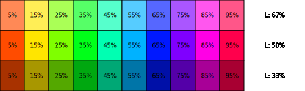

Note that we are using 100% saturation (colors are bright). Let’s see
what happens if we set the saturation to zero:

[source,c++]
----
include::tut03-no-saturation.inc.cpp[]
----

Here is the result:

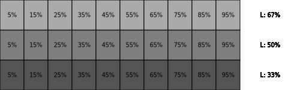

All the colors have turned into gray!

The comparison with the previous image reveals that the HSL color space
is not entirely physical, as there are some hues that are significantly
darker than others at the same luminosity (e.g., the blue square in the
`L: 33%` row is significantly darker than the green square in the same
row), but in the image below all the gray rectangles on the same row
have the same shade. Better color spaces exist (e.g.,
https://en.wikipedia.org/wiki/Luma_(video)[luma]), but Monet does not
implement them at the moment.

=== Paths ===

Apart from circles and text, Monet is able to draw more complex shapes.
_Paths_ are an important concept: they are built using consecutive calls
to `moveto`, `lineto`, and similar functions. Each command builds up a
path without drawing anything; in order to show the path, you must call
either `strokepath`, `fillpath`, or `fillandstrokepath`. Consider this
example:

[source,c++]
----
include::tut04.cpp[]
----

The code iterates over the `point` vector, starting with a `moveto`
instruction (the `if (i == 0)` branch) and then calling `lineto`
repeatedly. Finally, the `canvas.strokepath()` call draws all the lines
together as a single path. In order to make clear how the path was
constructed, the code uses a second `for` loop to place red dots over
each point and numbers beside them.

Here is the result:

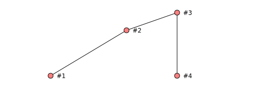

Let’s investigate what would have happened if we used `fillpath` instead
of `strokepath` in the code above:

[source,c++]
----
include::tut04-fill.inc.cpp[]
----

To “fill” an area, the area should be closed. That’s the reason why
Monet connects the last point (`#4`) to the first one (`#1`) before
filling the area:

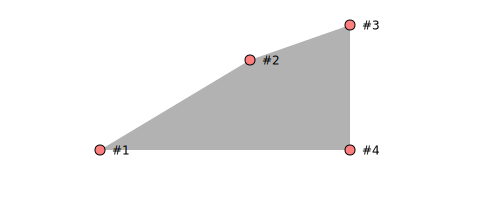

Using `fillandstrokepath` would draw the contour and fill it. Note that
in this case the path is _not_ closed:

To make the stroke closed as well, just call `closepath` _before_ call
`fillandstrokepath`:

[source,c++]
----
include::tut04-closepath.inc.cpp[]
----

Monet provides a handy function to quickly draw paths made by several
points: the `drawpath` function. Instead of the following code:

[source,c++]
----
std::vector<Point> points{Point(100, 50), Point(250, 140), Point(350, 175),
                          Point(350, 50)};

// Draw the path
for (size_t i = 0; i < points.size(); ++i) {
  if (i == 0)
    canvas.moveto(points[i]);
  else
    canvas.lineto(points[i]);
}
----

you can pass `points` to `canvas.drawpath`:

[source,c++]
----
std::vector<Point> points{Point(100, 50), Point(250, 140), Point(350, 175),
                          Point(350, 50)};

// Draw the path
canvas.drawpath(points);
----

Of course, a call to `canvas.drawpath` must be followed by a call to
`canvas.strokepath` or `canvas.fillpath` to have an effect.

Curved paths
^^^^^^^^^^^^

Paths can be curved too. The first type of curved path is a _quadratic
curve_, to be specified using the `quadraticto` method. In this case,
you must provide two points: the ``target'' point and the ``end'' point:

[source,c++]
----
include::tut05.cpp[]
----

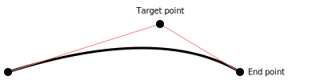

A more versatile curve is the _cubic curve_, which requires to specify
_two_ control points together with the end point:

[source,c++]
----
include::tut06.inc.cpp[]
----

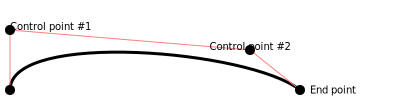

=== Transparencies ===

It is possible to make graphical elements partially transparent, using
the `settransparency` function.

[source,c++]
----
include::tut07.cpp[]
----

The code above produces a set of rectangles, starting from a fully
opaque red color to a 80% transparent violet hue. Note that the border
of the rectangles has _no_ transparency.

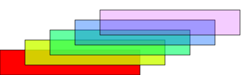

=== Transformations ===

Besides basic graphical commands like circles and rectangles, Monet
implements a transformation pipeline that allows to apply a number of
operations to graphical commands. Currently, the following operations
are supported:

* Rotations (`BasicCanvas::rotate`)
* Translation (`BasicCanvas::translate`)
* Scale transformations (`BasicCanvas::scale`, `BasicCanvas::scalex`,
`BasicCanvas::scaley`)

You can apply a sequence of transformations to _groups_, which are
sequences of graphical commands enclosed within a call to
`BasicCanvas::begingroup` and `BasicCanvas::endgroup`.

The following example shows how to apply rotations to some text:

[source,c++]
----
include::tut08.inc.cpp[]
----

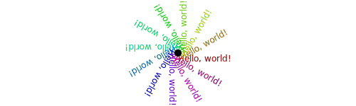

The example builds 12 groups, each containing a text object with content
`Hello, world!`. In the call to `begingroup` (which must always be
matched by a call to `endgroup`), we specify a composite transformation
using the operator `|`: the operation `rotate(angle) | translate(pivot)`
means that for each graphical element drawn within the calls to
`canvas.begingroup` and `canvas.endgroup` (in our case, the call to
`canvas.text`) must be _first_ rotated by an angle `angle` (in degrees),
and _then_ translated by `pivot.x` along the x axis and `pivot.y` along
the y axis.

Transformations are instances of the `monet::Transform` type, but you
should never instantiate it directly; instead, use one of the following
functions:

* `rotate(angle, pivot)`
* `rotate(angle)` (assume that `pivot = Point(0, 0)`)
* `translate(point)`
* `scale(factor)`, `scalex(factor)`, `scaley(factor`,
`scale(factor_x, factor_y)`

The operator `|` applies the sequence of transformations in sequence and
automatically builds a `TransformSequence` type (ordered list of
transformations). As `begingroup` expects a `TransformSequence` instead
of a `Transform`, if you want to apply _one_ operation instead of a
sequence, you should initialize a `TransformSequence` object using the
following syntax:

[source,c++]
----
canvas.begingroup(TransformSequence{scale(2)});
----

This will shrink every graphical command in the group twice their size.

=== Clipping ===

Monet has the ability to ``clip'' graphical commands, i.e., to disable
drawing outside some boundaries. This can be useful in complex drawings,
e.g., plots. To perform a clipping operation, you must follow these
steps:

1.  Call `BaseCanvas::defineclip()` (no arguments);
2.  Call whatever graphical operation you want, like `rectangle` and
`circle`, in order to identify the clipping region. Any graphical
operation drawing objects that fall outside the shapes drawn here will
be rejected.
3.  When the path is completed, call `BaseCanvas::endclip()` (no
arguments).
4.  You can activate and deactivate clipping by calling
`BaseCanvas::useclip()` and `BaseCanvas::removeclip()`.

The following example shows how to implement a clipping region made by a
complex path:

[source,c++]
----
include::tut09.inc.cpp[]
----

If we copy-and-paste the code from section
link:./tutorial.md#fun-with-colors[Fun with colors] after the call to
`canvas.useclip()`, we get the following result:

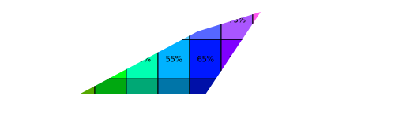
