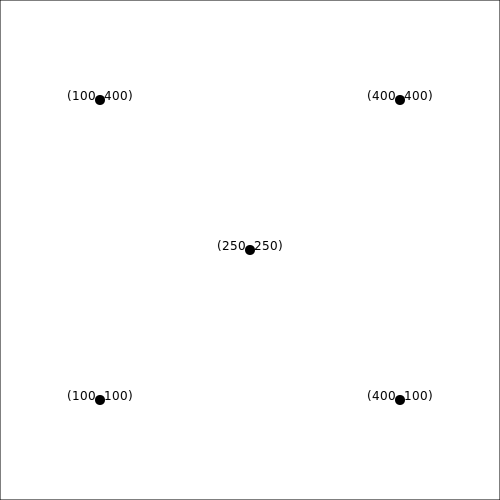
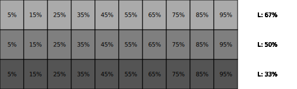
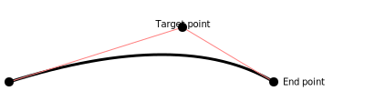

# Tutorial

## The first image

The first program we are going to write will use Monet to create a SVG
image containing a rectangle and a diagonal line.

Create an empty directory somewhere with name `tut01`, and install the
Monet header file in it with the following command:

    curl https://github.com/ziotom78/monet/include/monet.hpp > monet.hpp

(You can use `wget` or any other downloader, if you want.) Now use
your favourite editor to create the following C++ file, and name it
`tut01.cpp`:

{{code_from_file("tut01.cpp", "c++")}}

Compile the program and run it:

    gcc -o tut01 tut01.cpp && ./tut01

The result is the following:


## Coordinate system

Monet can create rectangular images, where each point in the image is
located using a Cartesian coordinate system. The bottom-left corner of
the image has always coordinates (0, 0). The coordinates of the
upper-right corner depend on the size of the image, that must be
passed to the constructor. This is what we did in `tut01`:

```c++
SVGCanvas canvas("tut01.svg", 500, 500);
```

This instruction tells Monet that the image will be 500×500 wide,
i.e., a square.

In the following example, we use `SVGCanvas.text` and
`SVGCanvas.circle` to show the coordinates of a few points in a
canvas.

{{code_from_file("tut02.cpp", "c++")}}

Compile the code as usual; the output will be the following:



You can see that the *x* and *y* coordinates increase from left to
right, and from bottom to top, like in the Cartesian plane.

Many new concepts are used in this new program:

1. We have used a C++ `for` loop to iterate the creation of many
   graphical elements; of course, as Monet is used in C++ programs, we
   can use any construct we want to place graphical elements on the
   canvas.
1. We have used text functions.
2. We have used mathematical operations with the `Point` structure.

The call to `canvas.text` passes `pt + Point(0, canvas.getfontsize())`
as the coordinate where to put the text. `monet::Point` is a structure
that can be used with a few mathematical operators. In our example, we
used the addition (`operator+`) in order to shift the text a bit above
the circle. The amount of vertical shift is given by the result of a
call to `canvas.getfontsize()`, which returns the height of a
character of text. Had we avoided the call to `canvas.getfontsize()`,
like here:

{{snippet_from_file("tut02-bad.cpp", "c++")}}

the result would have been uglier:


## Fun with colors

There are three ways to specify colors in Monet:

1. Use one of the predefined constants, like `black`, `yellow`,
   `darkred`, `lightgreen`, etc.;
2. Specify a color using its RGB (red-green-blue) components;
3. Specify a color using its HSL (hue-saturation-lightness) components.

Here is an example:

```c++
Color color1 = black;
Color color2 = rgb(0.5, 1.0, 0.5);
Color color3 = hsl(0.3, 0.5, 0.75);
```

RGB and HSL use three floating-point numbers in the range [0, 1] to
specify colors. In the example above, `color2` is a color made 50% of
red, 100% of green and 50% of blue: a light green. We will not spend
much time about RGB colors, as they are widely used and plenty of
explanations can be found on the web (by the way, it is the standard
way to encode colors in HTML).

Color `color3` is specified using its hue, saturation, and luminosity
components. This is a somewhat more physical way of identifiying a
color, but it is user far less than RGB, so we will spend some more
time on it. The three numbers have the following meaning:

1. Its hue is at one third of the distance between red (0) and blue
   (1) in the electromagnetic spectrum (it is a measure of the
   wavelength of monocromatic light);
2. Its saturation is halfway (50%) between gray and the fully bright hue;
3. Its luminosity is 75% between black (0%) and white (100%).

Playing with luminosity helps in making the images lighter or
darker. Note that if luminosity is 0, the color is black regardless of
hue and saturation; similarly, the color is always white if luminosity
is 1.

Here is an example of the shades you can get by playing with the hue
and the saturation:

{{code_from_file("tut03.cpp", "c++")}}

And here is the result:


Note that we are using 100% saturation (colors are bright). Let's see what happens if we set the saturation to zero:

{{snippet_from_file("tut03-no-saturation.cpp", "c++")}}

Here is the result:



All the colors have turned into gray!

The comparison with the previous image reveals that the HSL color
space is not entirely physical, as there are some hues that are
significantly darker than others at the same luminosity (e.g., the
blue square in the `L: 33%` row is significantly darker than the green
square in the same row), but in the image below all the gray
rectangles on the same row have the same shade.

## Paths

Apart from circles and text, Monet is able to draw more complex
shapes. *Paths* are an important concept: they are built using
consecutive calls to `moveto`, `lineto`, and similar functions. Each
command builds up a path without drawing anything; in order to show
the path, you must call either `strokepath`, `fillpath`, or
`fillandstrokepath`. Let's a very simple example:

{{code_from_file("tut04.cpp", "c++")}}

The code iterates over the `point` vector, starting with a `moveto`
instruction (the `if (i == 0)` branch) and then calling `lineto`
repeatedly. Finally, the `canvas.strokepath()` call draws all the
lines together as a single path. In order to make clear how the path
was constructed, the code uses a second `for` loop to place red dots
over each point and numbers beside them.

Here is the result:


Let's investigate what would have happened if we used `fillpath`
instead of `strokepath` in the code above:

{{snippet_from_file("tut04-fill.cpp", "c++")}}

To “fill” an area, the area should be closed. That's the reason why
Monet connects the last point (`#4`) to the first one (`#1`) before
filling the area:


Using `fillandstrokepath` would draw the contour and fill it. Note
that in this case the path is *not* closed:


To make the stroke closed as well, just call `closepath` *before* call
`fillandstrokepath`:

{{snippet_from_file("tut04-closepath.cpp", "c++")}}


Paths can be curved too. The first type of curved path is a *quadratic
curve*, to be specified using the `quadraticto` method. In this case,
you must provide two points: the “target” point and the “end” point:

{{code_from_file("tut05.cpp", "c++")}}



A more versatile curve is the *cubic curve*, which requires to specify
*two* control points together with the end point:

{{snippet_from_file("tut06.cpp", "c++")}}


